# 🎓 Practical Lesson: Authentication System with Clean Architecture

This project was developed as a practical guide for developers who want to learn and apply the principles of **Clean Architecture** in Java. The goal is to demonstrate how to create a highly testable system that is independent of frameworks and easy to maintain.

**[🇧🇷 Versão em Português (README.md)](README.md)**

---

## 🏗️ What is Clean Architecture?

Proposed by Robert C. Martin (Uncle Bob), Clean Architecture aims for the **separation of concerns**. The central point is the **Dependency Rule**: code dependencies can only point inwards, towards the business rules (Core).

- **Nothing in the inner layer knows anything about something in the outer layer.**
- The **Core** doesn't know which database you use (SQL, NoSQL).
- The **Core** doesn't know if the request comes from a REST API, CLI, or GraphQL.

---

## 🗺️ Diagram Walkthrough: The Request Path

To understand how the files interact, let's follow the flow of a user trying to log in:

### Request Flow (Inward)
1. **`AuthController`**: Receives user JSON -> Converts to `AuthenticateUserRequestDTO`.
2. **`UserMapper`**: Transforms the DTO into a domain object (Entity or Request Object).
3. **`AuthenticateUserUseCase`**: Receives data and executes the logic:
   - Calls the `UserGateway` (Interface) to fetch the user.
   - Spring injects the actual implementation: `UserGatewayImpl`.
   - `UserGatewayImpl` uses the `UserRepository` (JPA) to query the database.
   - Returns the `UserEntity` (JPA) which is mapped back to `User` (Domain).
   - The Use Case verifies the password using the `PasswordEncoder`.
   - If okay, generates the Token via `TokenGateway`.

### Response Flow (Outward)
1. **`AuthenticateUserUseCase`**: Returns an `AuthenticationResponse` object (Domain).
2. **`UserMapper`**: Transforms the domain object into `AuthenticationResponseDTO`.
3. **`AuthController`**: Returns the DTO with Status 200 (OK) to the client.

```mermaid
sequenceDiagram
    participant Client as 📱 Client/Frontend
    participant Controller as 🎮 AuthController
    participant UseCase as 🧠 AuthenticateUserUseCase
    participant Gateway as 🚪 UserGateway (Interface)
    participant Persistence as 💾 UserGatewayImpl (Infra)
    participant DB as 🗄️ Database (PostgreSQL/H2)

    Client->>Controller: POST /api/v1/auth/login
    Controller->>UseCase: execute(request)
    UseCase->>Gateway: findByEmail(email)
    Gateway->>Persistence: findByEmail(email)
    Persistence->>DB: SELECT * FROM users...
    DB-->>Persistence: User Data
    Persistence-->>Gateway: User Object
    Gateway-->>UseCase: User Entity
    UseCase->>UseCase: Validate Password
    UseCase-->>Controller: Token/Success
    Controller-->>Client: 200 OK + JWT
```

---

## 📂 Folder and File Structure

### 1. 🟢 `core/` Layer (The Heart)
This layer contains pure business rules. **It must not have Spring, JPA, or any framework annotations.**

| Folder/File | What is it? | Characteristics | Example |
| :--- | :--- | :--- | :--- |
| `entities/` | Business Objects | Represent the "being" of the system. They have state and behavior. | `User.java` (Validates if email is valid upon creation). |
| `enums/` | Domain Types | Define fixed options that are part of the business. | `Role.java` (ADMIN, USER). |
| `gateway/` | Outgoing Ports | **Interfaces** that define what the system needs from the outside world. | `UserGateway.java` (`save(User)` method). |
| `usecases/` | Application Rules | Orchestrate the data flow and apply business rules. | `CreateUserUseCase.java` (Checks if email exists before saving). |

---

### 2. 🔵 `infrastructure/` Layer (The Detail)
This layer contains tools and frameworks. This is where Spring, JPA, and other libraries live.

| Folder/File | What is it? | Characteristics | Example |
| :--- | :--- | :--- | :--- |
| `presentation/` | Controllers | API entry point. Handle HTTP and JSON. | `UserController.java`. |
| `dto/` | Data Contracts | Simple objects for data input/output via API. | `UserRegistrationRequest.java`. |
| `persistence/` | Database | JPA Entities and Repositories (Spring Data). | `UserEntity.java` (With `@Entity`, `@Table`). |
| `gateway/` | Implementations | Real version of Core interfaces. | `UserGatewayImpl.java` (Uses Repository to save). |
| `mapper/` | Translators | Convert objects between layers (Entity <-> Domain <-> DTO). | `UserMapper.java`. |
| `config/` | Configurations | Security, JWT, and Framework setup. | `SecurityConfig.java`. |
| `beans/` | Injection | Where we teach Spring how to create Core classes. | `UserConfig.java` (Instantiates UseCases). |

---

## 🛠️ Technologies and Tools

- **Java 17 & Spring Boot 3**: Project base.
- **Spring Security + JWT**: Route protection and authentication.
- **MapStruct**: Automates object mapping (avoids hundreds of `get/set`).
- **SpringDoc (Swagger)**: Interactive documentation (Access: `/swagger-ui.html`).
- **Flyway**: Database version management.
- **Lombok**: Removes visual noise from getters/setters.

---

## 🚀 How does this project help you learn?

1. **Code Separation**: Try changing the database from H2 to PostgreSQL. You will see that **only the infrastructure layer changes**.
2. **Testability**: Look at the `test/` folder. Use Case tests don't need a database or server running; they test pure logic.
3. **Scalability**: Adding a new feature (e.g., Delete User) involves creating the Use Case in the Core and then the Controller/Gateway in Infra. The path is always clear.

---

## 📋 How to Run

1. Clone: `git clone https://github.com/rlevi/studying_clean_architecture.git`
2. Run: `./mvnw spring-boot:run`
3. Test: Access `http://localhost:8080/swagger-ui.html` to see the documentation.

---
*This project was created by **Rlevi** for educational purposes. Feel free to contribute or use it as a base for your studies!*
