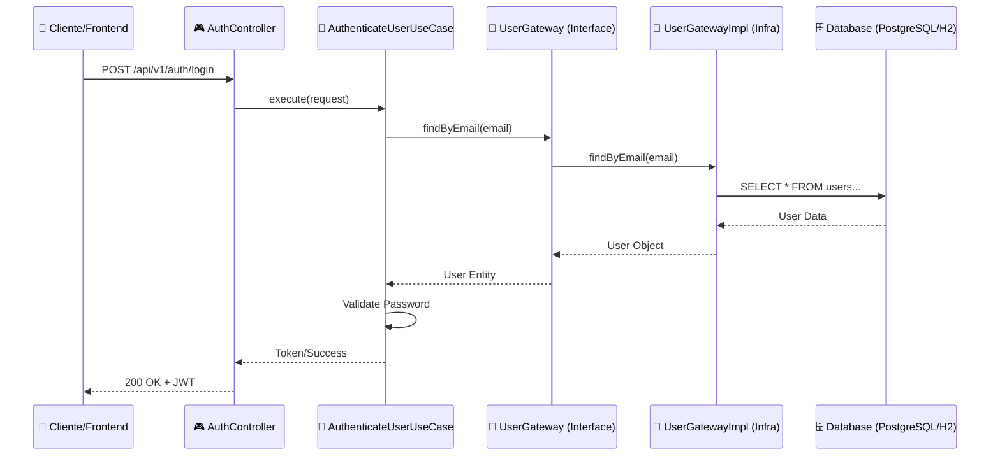

# 🎓 Aula Prática: Sistema de Autenticação com Clean Architecture

Este projeto foi desenvolvido como um guia prático para desenvolvedores que desejam aprender e aplicar os princípios da **Clean Architecture** (Arquitetura Limpa) em Java. O objetivo é demonstrar como criar um sistema altamente testável, independente de frameworks e fácil de manter.

**[🇺🇸 English Version (README-en.md)](README-en.md)**

---

## 🏗️ O que é Clean Architecture?

Proposta por Robert C. Martin (Uncle Bob), a Clean Architecture visa a **separação de preocupações**. O ponto central é a **Regra de Dependência**: as dependências de código só podem apontar para dentro, em direção às regras de negócio (Core).

- **Nada na camada interna sabe nada sobre algo na camada externa.**
- O **Core** não sabe qual banco de dados você usa (SQL, NoSQL).
- O **Core** não sabe se a requisição vem de uma API REST, CLI ou GraphQL.

---

## 🗺️ Diagram Walkthrough: O Caminho da Requisição

Para entender como os arquivos conversam, vamos seguir o fluxo de um usuário tentando fazer login:

### Fluxo de Ida (Request)
1. **`AuthController`**: Recebe o JSON do usuário -> Converte para `AuthenticateUserRequestDTO`.
2. **`UserMapper`**: Transforma o DTO em um objeto de domínio (Entity ou Request Object).
3. **`AuthenticateUserUseCase`**: Recebe os dados e executa a lógica:
   - Chama o `UserGateway` (Interface) para buscar o usuário.
   - O Spring injeta a implementação real: `UserGatewayImpl`.
   - `UserGatewayImpl` usa o `UserRepository` (JPA) para consultar o banco.
   - Retorna a `UserEntity` (JPA) que é mapeada de volta para `User` (Domínio).
   - O Use Case verifica a senha usando o `PasswordEncoder`.
   - Se ok, gera o Token via `TokenGateway`.

### Fluxo de Volta (Response)
1. **`AuthenticateUserUseCase`**: Retorna um objeto `AuthenticationResponse` (Domínio).
2. **`UserMapper`**: Transforma o objeto de domínio em `AuthenticationResponseDTO`.
3. **`AuthController`**: Retorna o DTO com Status 200 (OK) para o cliente.

---

## 📂 Estrutura de Pastas e Arquivos

### 1. 🟢 Camada `core/` (O Coração)
Esta camada contém as regras de negócio puras. **Não deve possuir anotações de Spring, JPA ou qualquer framework.**

| Pasta/Arquivo | O que é? | Características | Exemplo |
| :--- | :--- | :--- | :--- |
| `entities/` | Objetos de Negócio | Representam o "ser" do sistema. Possuem estado e comportamento. | `User.java` (Valida se o email é válido ao ser criado). |
| `enums/` | Tipos do Domínio | Definem opções fixas que fazem parte do negócio. | `Role.java` (ADMIN, USER). |
| `gateway/` | Portas de Saída | **Interfaces** que definem o que o sistema precisa do mundo externo. | `UserGateway.java` (Método `save(User)`). |
| `usecases/` | Regras de Aplicação | Orquestram o fluxo de dados e aplicam as regras de negócio. | `CreateUserUseCase.java` (Verifica se email existe antes de salvar). |

---

### 2. 🔵 Camada `infrastructure/` (O Detalhe)
Esta camada contém as ferramentas e frameworks. É aqui que o Spring, JPA e outras bibliotecas vivem.

| Pasta/Arquivo | O que é? | Características | Exemplo |
| :--- | :--- | :--- | :--- |
| `presentation/` | Controllers | Ponto de entrada da API. Lidam com HTTP e JSON. | `UserController.java`. |
| `dto/` | Contratos de Dados | Objetos simples para entrada/saída de dados via API. | `UserRegistrationRequest.java`. |
| `persistence/` | Banco de Dados | Entidades JPA e Repositórios (Spring Data). | `UserEntity.java` (Com `@Entity`, `@Table`). |
| `gateway/` | Implementações | Versão real das interfaces do Core. | `UserGatewayImpl.java` (Usa o Repository para salvar). |
| `mapper/` | Tradutores | Convertem objetos entre camadas (Entity <-> Domain <-> DTO). | `UserMapper.java`. |
| `config/` | Configurações | Setup de Segurança, JWT e Frameworks. | `SecurityConfig.java`. |
| `beans/` | Injeção | Onde ensinamos o Spring a criar as classes do Core. | `UserConfig.java` (Instancia UseCases). |

---

## 🛠️ Tecnologias e Ferramentas

- **Java 17 & Spring Boot 3**: Base do projeto.
- **Spring Security + JWT**: Proteção de rotas e autenticação.
- **MapStruct**: Automatiza o mapeamento entre objetos (evita centenas de `get/set`).
- **SpringDoc (Swagger)**: Documentação interativa (Acesse: `/swagger-ui.html`).
- **Flyway**: Gerenciamento de versões do banco de dados.
- **Lombok**: Remove o barulho visual de getters/setters.

---

## 🚀 Como este projeto ajuda você a aprender?

1. **Separação de Código**: Tente mudar o banco de dados de H2 para PostgreSQL. Você verá que **apenas a camada de infraestrutura muda**.
2. **Testabilidade**: Olhe a pasta `test/`. Os testes de Use Cases não precisam de banco de dados ou servidor rodando; eles testam lógica pura.
3. **Escalabilidade**: Adicionar um novo recurso (ex: Excluir Usuário) envolve criar o Caso de Uso no Core e depois o Controller/Gateway na Infra. O caminho é sempre claro.

---

## 📋 Como Executar

1. Clone: `git clone https://github.com/rlevi/studying_clean_architecture.git`
2. Rode: `./mvnw spring-boot:run`
3. Teste: Acesse `http://localhost:8080/swagger-ui.html` para ver a documentação.

---
*Este projeto foi criado por **Rlevi** para fins educacionais. Sinta-se à vontade para contribuir ou usar como base para seus estudos!*
